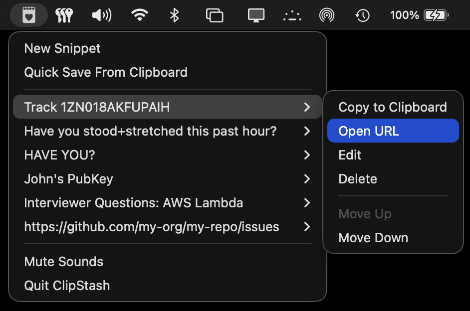

#  SnipStash 

A lightweight, open-source macOS Menu Bar-only app for quickly stashing and managing plaintext snippets via the clipboard.

## Purpose

SnipStash lives in your Menu Bar so you can capture, store, and recall text snippets without leaving your workflow. It's ideal for:

- Quick captures from the clipboard that you don't want to lose, like tracking numbers
- Blocks of text you need to temporarily stash somewhere while rearranging code or a document
- Frequently used snippets (boilerplate, commands, links, public keys, how-to steps)
- Capturing the plaintext version of rich clipboard data
- Unintrusive nudges that don't warrant notifications, like standing and stretching

## Features

- **Menu Bar access** — Runs only in the macOS Menu Bar for quick access
- **Quick Save from Clipboard** — One-click to save the current clipboard contents to the stash
- **Create & Edit** — Edit and manually create snippets with custom menu labels
- **Copy to clipboard** — Copy any snippet's content back to the clipboard
- **Open URL** — Quickly open URL snippets from the Menu Bar
- **Reorder Snippets** — Move snippets up or down to change their order
- **Delete Snippets** — Remove snippets with confirmation (hold Option or Shift to skip confirmation)
- **Persistent storage** — SnipStash data is stored locally with [SwiftData](https://developer.apple.com/documentation/swiftdata/)

## Privacy

SnipStash does not collect, send, or share your data. Everything stays on your Mac under your user account. The app is open source, contains no trackers or analytics, and makes no network calls. We will never snoop on you. Read more in our full [Privacy Policy](./PRIVACY.md).

**Reminder:** SnipStash is not a password manager and should not be used to store passwords or other secrets. Use a dedicated password manager for sensitive credentials.

## Requirements

- macOS 26 or higher
- Xcode (for building)

## Building

1. Open `SnipStash.xcodeproj` in Xcode
2. Build and run (⌘R)

## Releasing

Pushing a semantic version tag (e.g. `v1.0.0` or `1.0.0`) triggers a GitHub Action that builds, signs, notarizes, and publishes a release.

### Required GitHub Secrets

Configure these in **Settings → Secrets and variables → Actions**:

| Secret | Description |
|--------|-------------|
| `APPLE_CERTIFICATE_BASE64` | Base64-encoded `.p12` Developer ID Application certificate. Export from Keychain Access (certificate + private key) as `.p12`, then run `base64 -i Certificates.p12 -o Certificates.base64` and paste the contents. |
| `APPLE_CERTIFICATE_PASSWORD` | Password used when exporting the `.p12` file. |
| `APPLE_SIGNING_IDENTITY` | Full certificate name, e.g. `Developer ID Application: Your Name (TEAM_ID)`. Find in Keychain Access or run `security find-identity -v -p codesigning`. |
| `APPLE_ID` | Your Apple Developer account email. |
| `APPLE_TEAM_ID` | Team ID from [developer.apple.com/account](https://developer.apple.com/account/#!/membership). |
| `APPLE_APP_SPECIFIC_PASSWORD` | App-specific password from [appleid.apple.com](https://appleid.apple.com/account/manage) → Sign-in and Security → App-Specific Passwords. |
| `KEYCHAIN_PASSWORD` | A strong random password for the temporary keychain (e.g. `openssl rand -base64 32`). |

### Prerequisites

- [Apple Developer Program](https://developer.apple.com/programs/) membership (~$99/year)
- A **Developer ID Application** certificate (create one in [Certificates, Identifiers & Profiles](https://developer.apple.com/account/resources/certificates/list))

## Tech Stack

- SwiftUI
- SwiftData
- AppKit

## Contributor Disclosure

Currently, the entirety of this project (application code, imagery, and documentation), save for minor edits to this README, was written 100% by Artificial Intelligence using a combination of Claude 4.x, ChatGPT 5.x, and Cursor Composer 1.x. In short, it was "Vibecoded." 

While we welcome Pull Requests and other contributions from other humans, we do not accept contributions from AI bots. A human must review, understand, and sign off on all commits. Please file an issue to discuss any proposed feature before working on it.

When humans start contributing their own code to the project, we will update this disclosure accordingly.