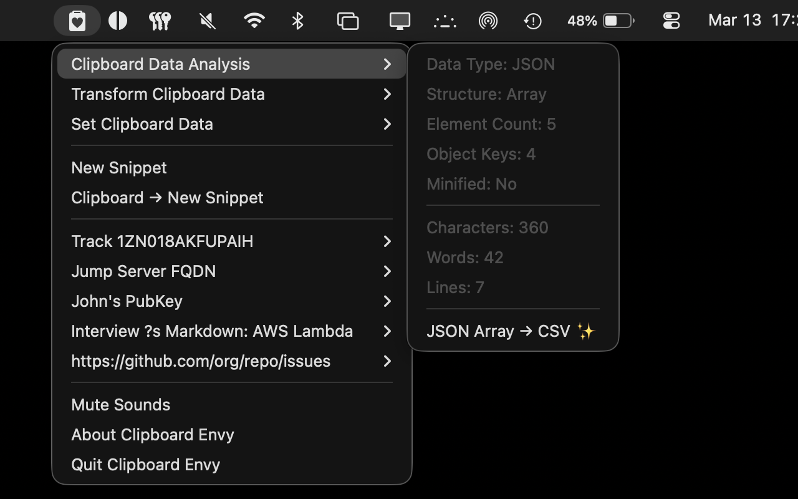
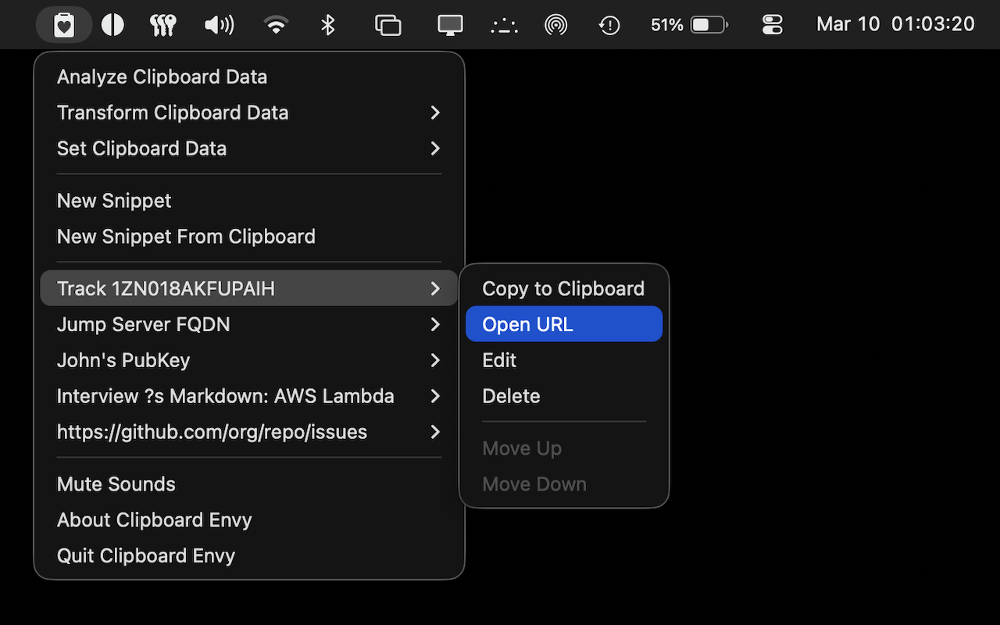
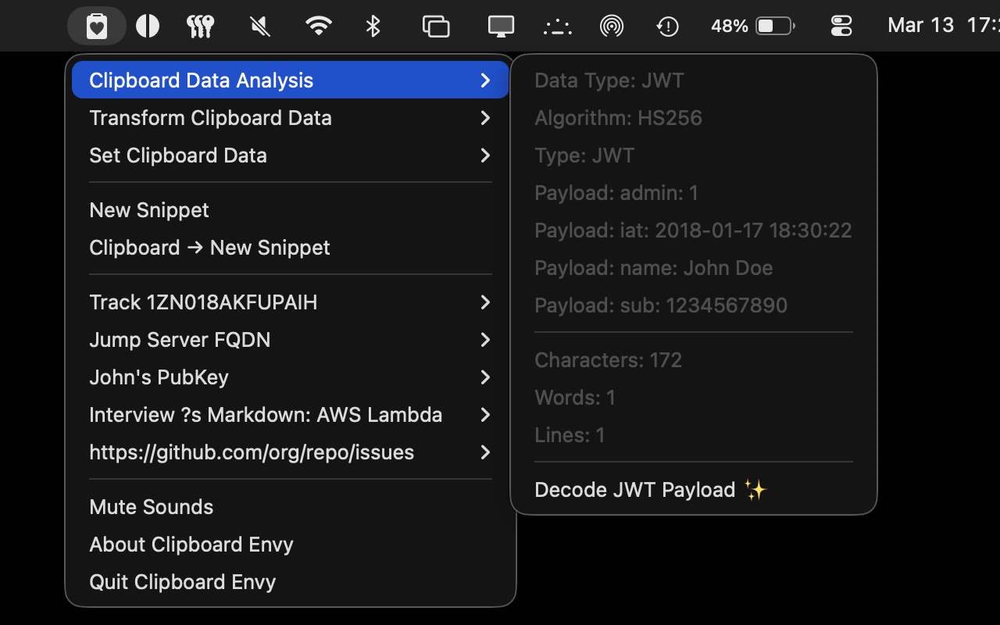
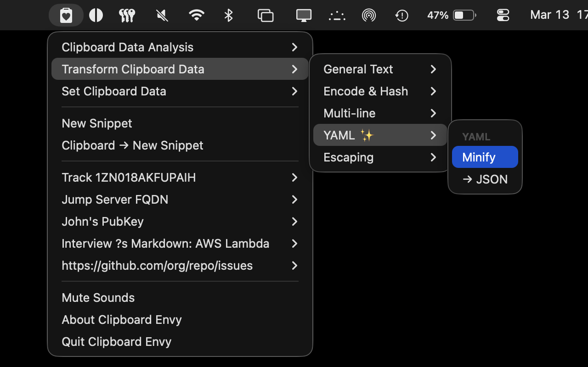
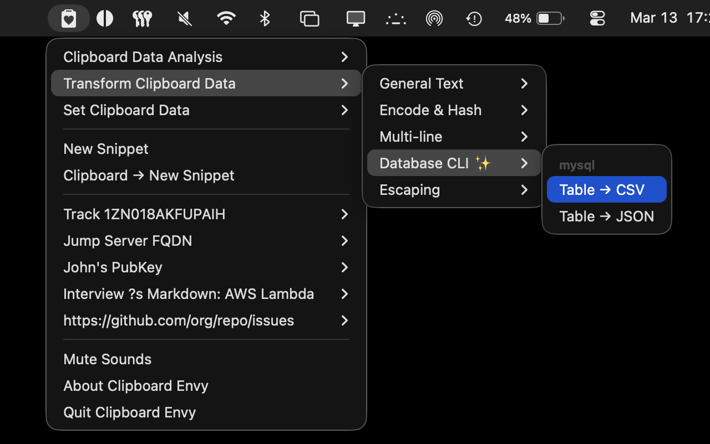
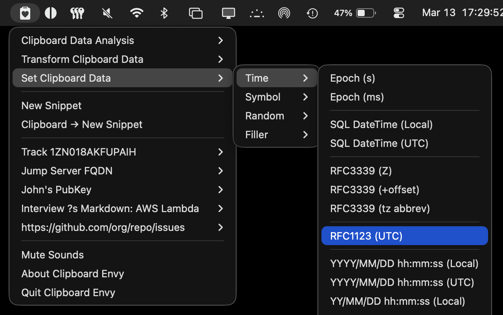
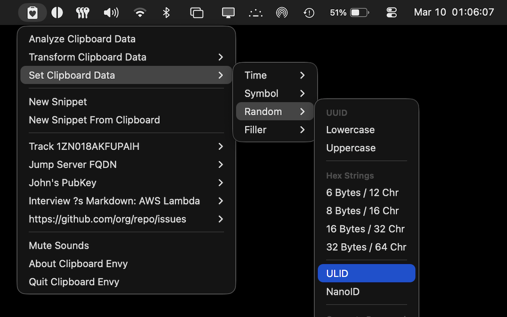
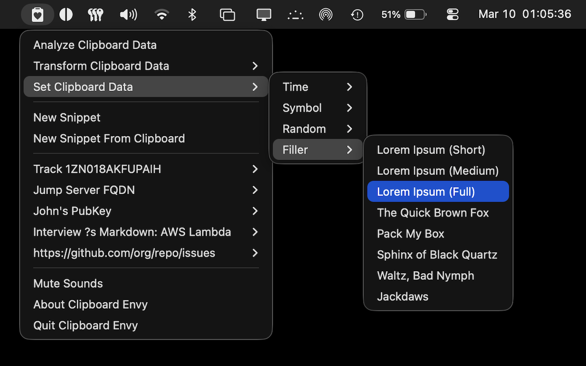

#  Clipboard Envy 

A lightweight, developer-focused macOS Menu Bar-only app for managing and transforming Clipboard data.

Clipboard Envy is [available in the App Store](https://apps.apple.com/us/app/clipboard-envy/id6759918875) or can be downloaded directly from [this project's releases](https://github.com/centennial-oss/clipboard-envy/releases).

## About

Clipboard Envy lives in your Menu Bar so you can capture, store, transform, and recall text snippets without leaving your workflow. It's ideal for developers who use tools like JWT Decoders, SHA-1 Hashers, JSON Minifiers, etc. We have over 100 built-in tools, organized in a coherent, easy-access Menu.

In addition to developer tools, Clipboard Envy is great for the average user to do things like:
- Quickly capture snippets that you don't want to lose, like tracking numbers
- Blocks of text you need to temporarily stash somewhere while rearranging an article or paper
- Frequently used snippets (boilerplate, shell commands, links, public keys, how-to steps)

## Features

- **Menu Bar access** — Runs only in the macOS Menu Bar for quick access
- **Capture Snippet from Clipboard** — One-click to save the current clipboard contents to the stash, and to set back to the Clipbard
- **Open URL** — Quickly open URL snippets from the Menu Bar
- **Analyze Clipboard** - Reveals context-specific info about the Clipboard contents like word and line counts, as well as zero-width unicode character detection.
- **Transform Clipboard Data** - Developer-friendly one-click transformations like convert clipboard contents to lowercase, prettify/minify JSON, Base64-encode/decode, sort and de-duplicate lines, and more!
- **Set Clipboard Data** - One-click to set the clipboard contents to the current epoch timestamp, random values like generated passwords or UUIDs, filler text like Lorem Ipsum, and common symbols that aren't on most keyboards.

## Screenshots

 JSON Minify" width="875" />

 DB Table to CSV" width="875" />

 Current SQL DateTime" width="875" />

 ULID" width="875" />

 Lorem Ipsum" width="875" />

## Privacy

Clipboard Envy does not collect, send, or share your data. Everything stays on your Mac under your user account. The app is open source, contains no trackers or analytics, and makes no network calls. We will never snoop on you. Read more in our full [Privacy Policy](./PRIVACY.md).

**Reminder:** Clipboard Envy is not a password manager and should not be used to store passwords or other secrets. Use a dedicated password manager for sensitive credentials.

## Requirements

### Running
- An Apple Macintosh computer running macOS 15 or higher

### Developer
- Xcode (for building locally), including Command Line Tools
- SwiftLint

## Building

1. Open `ClipboardEnvy.xcodeproj` in Xcode
2. Build and run (⌘R)

## Tech Stack

- SwiftUI
- SwiftData
- AppKit

## Contributor Disclosure

Humans write this software with AI Assistance. All contributions are well-tested and merged only after being reviewed and approved by humans who fully understand and take responsibility for the contribution.

While we welcome Pull Requests and other contributions from other humans (including AI-generated code), we do not accept contributions from AI bots. A human must review, understand, and sign off on all commits. Please file an issue to discuss any proposed feature before working on it.
